# گزارش آزمایش پنجم آزمایشگاه نرم‌افزار

## راه‌اندازی yourkit

## بررسی کلاس JavaCup
طبق گزارش yourkit در تصویر زیر 96% از مصرف کل متعلق به تابع temp() بوده.
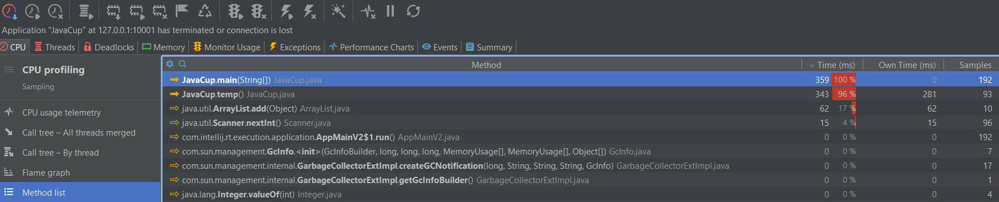
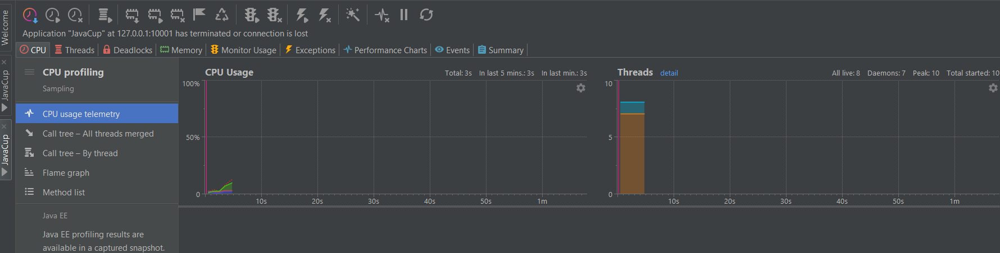
مصرف حافظه را در دو پروفایلر بررسی کردیم، اولی مربوط به پروفایلر خود intellij است که نشان می‌دهد ()temp بیشترین حافظه را گرفته و دومی نیز data type بیشترین مصرف کننده را نشان می‌دهد.
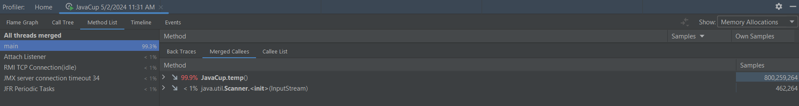

همانطور که مشخص است این تابع نقشی در عملکرد اصلی کار ندارد و می‌توان آن را حذف نمود ولی اگر بخواهیم همین کد را بهینه کنیم طبق تصویر زیر ArrayList بودن نوع داده هزینه‌ی زیادی دارد، پس آن را تغییر می‌دهیم و مطابق تصویر زیرین کد جدید را می‌نویسیم.
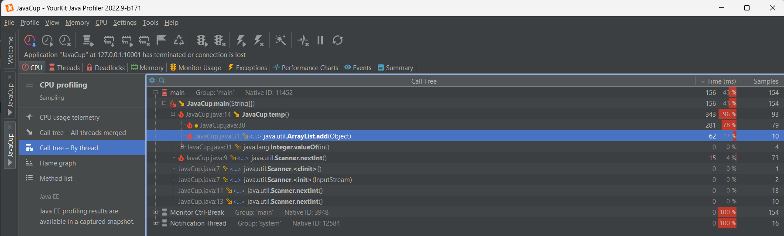
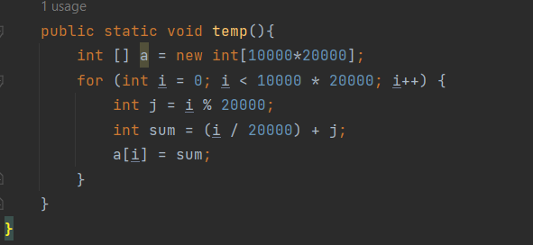

پس از اجرای دوباره با yourkit دیگر hotspot ی شناسایی نشده و در زیر 1 میلی ثانیه اجرای برنامه به اتمام می‌رسد.
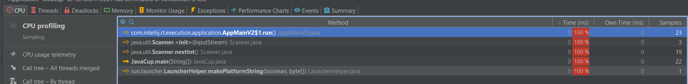

## اضافه کردن کلاس PrimeChecker
برای بررسی زمان و حافظه‌ی مصرفی یک الگوریتم دیگر توسط yourkit از دو الگوریتم برای چک کردن اعداد اول استفاده می‌کنیم. مطابق تصویر زیر تابع isPrimeInefficient یک تابع غیر بهینه و isPrimeOptimized نسخه‌ی بهینه‌ی آن است. برای اینکه تمایز بین این دو بیشتر دیده شود از 50 عدد 10 رقمی استفاده کرده‌ایم.
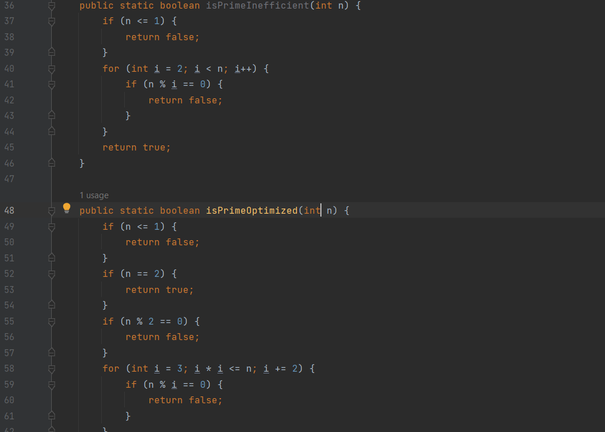

در ابتدا تنها isPrimeInefficient را اجرا می‌کنیم و می‌بینیم که توسط yourkit به عنوان Hotspot شناسایی شده که 100% از مصرف پردازنده را به خود اختصاص داده.
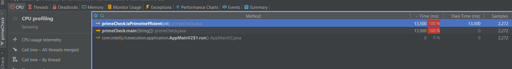
اما اگر هر دو را با هم اجرا کنیم می‌بینیم که 99% از اجرا مطابق تصویر زیر متعلف به isPrimeInefficient بوده. دیگر نیازی به اجرای جداگانه‌ی isPrimeOptimized نبود چون hotspot شناخته نشد.
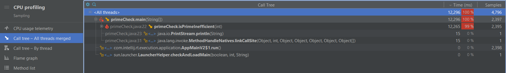

دو تصویر زیر هم تفاوت در حافظه را نشان می‌دهند که قابل چشم پوشی است چون هر دو از نظر حافظه مشابه عمل می‌کنند. (تصویر دوم مربوط به زمانی است که هر دو با هم اجرا شده‌اند برای همین بیشتر زمان برده)

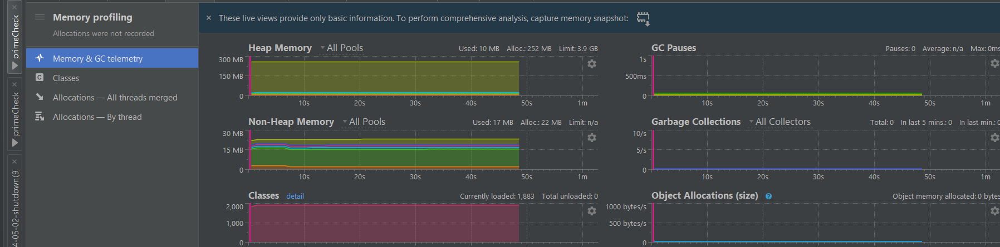
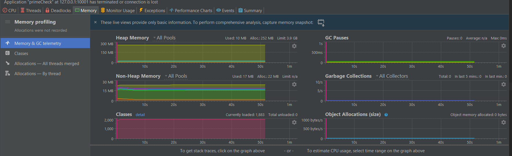
